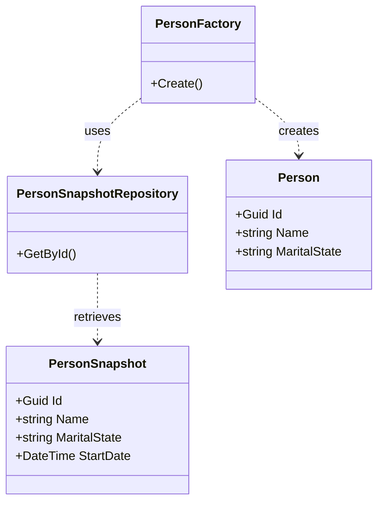

+++
title = 'There is no such thing as Clean Code'
date = 2024-03-20
tags = ['coding']
+++

Bear with me. 

I am under the impression that I write Clean Code. You might be too. And you're right. But you're also wrong. 

I had a discussion at work the other week about a design decision in our codebase. I'll try to sketch the situation as simply as possible. Basically we have temporal objects called `Snapshots`. To give an example, imagine a `Person` that looks something like this:

```csharp
public class Person 
{
    public Guid Id { get; set; }    
    public string Name { get; set; }
    public string MaritalState { get; set; }
}
```

We know the name of a person, and usually this doesn't change. And even if it does their new name is the new truth. This doesn't need to be kept temporally. However, in the case of `MaritalState`, we do need the correct info at a certain point in time in order to make calculations in the past. So that's why we have a `PersonSnapshot` class. It looks something like this:

```csharp
public class PersonSnapshot
{
    public Guid Id { get; set; }   
    public string Name { get; set; }
    public string MaritalState { get; set; }
    public DateTime StartDate { get; set; }
}
```

One `Person` could be identified as three different `PersonSnapshots`. Depending on which point in time you need this info, you'd need a different snapshot to give the correct info. I've given a simplified version of this principle, there are a couple more parameters that govern temporal data that I've left out for brevity's sake. 

In order for other developers to use the correct object we've devised a `PersonFactory` class. This takes care of all the nitty gritty of how to get the correct `PersonSnapshot` in time and transforms it into a `Person` object.

On the other hand there's also a `PersonSnapshotRepository` class that handles the DB access for getting and saving `PersonSnapshots`. The whole picture looks something like this:



Any service that needed a `Person` object should pass through the `PersonFactory` and retrieve the object through it. However, newer devs recreated the implementation by calling the `PersonSnapshotRepository` and reimplementing (sometimes with bugs) the same logic as already written in the `PersonFactory`.

We discussed the reasoning behind it. And it came down to people finding it confusing going through a *Factory* to *fetch data*. They didn't want to create a `Person` object out of thin air, they wanted to *fetch* it. What fetches data? A *Repository*. By using  this method they bypass the creation of a `Person` object and use a `PersonSnapshot` directly.

One could also make an argument that the role of a Factory concerns the way an object is created. If, in that process, data is required in order to create said object, it does not violate the use of the Design Pattern.

Either way you look at it, the point I'm trying to make is that all perception is relative. There are nuances that have merit for both sides of the argument. In my eyes, the design made perfect sense, but to others it didn't. 

The **key giveaway** is that Clean Code is not an individual trait in a codebase. It's a pillar that is maintained by every member of the team. If one person has an objection or a misconception about the code, it should be addressed and discussed. What might make sense for me, might be utter gibberish to the next guy.

**Be susceptible to critique**. If someone disagrees with you, find common ground and build on it. The code will be better for it, your working relation with your colleagues will be better for it and the willingness to maintain the code will increase. 